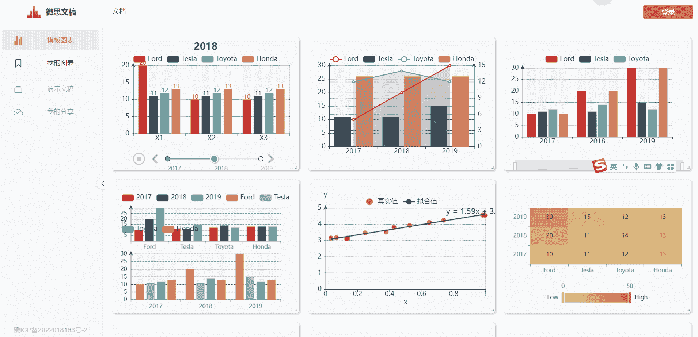
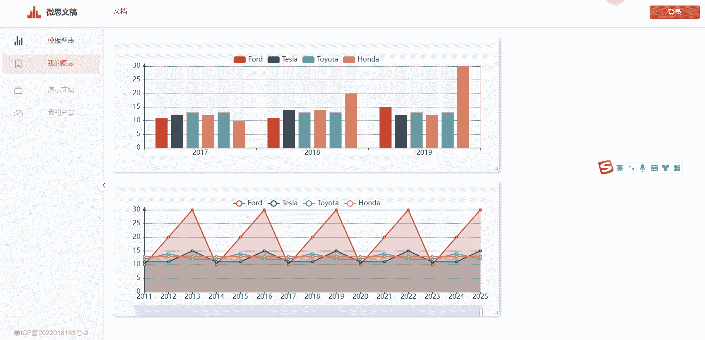
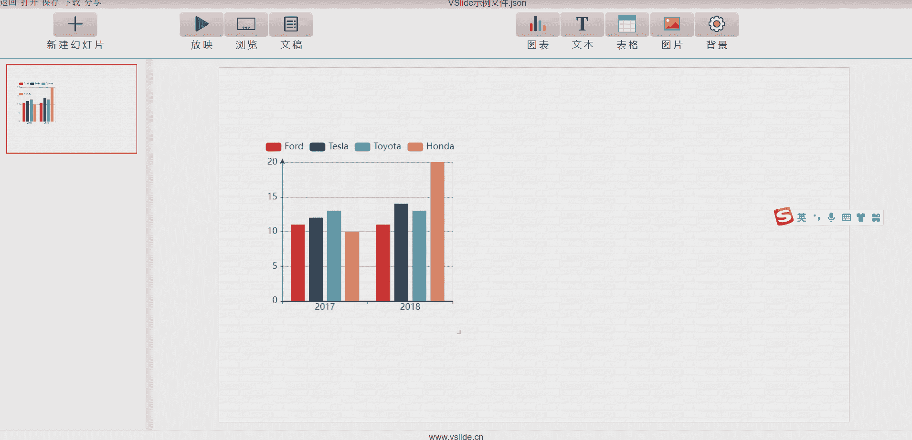
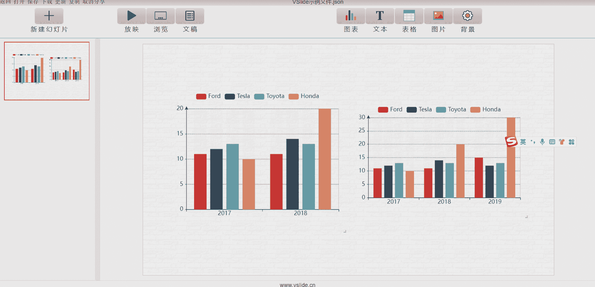
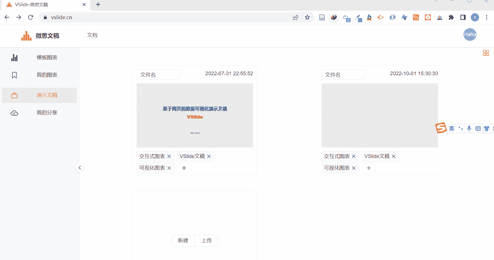
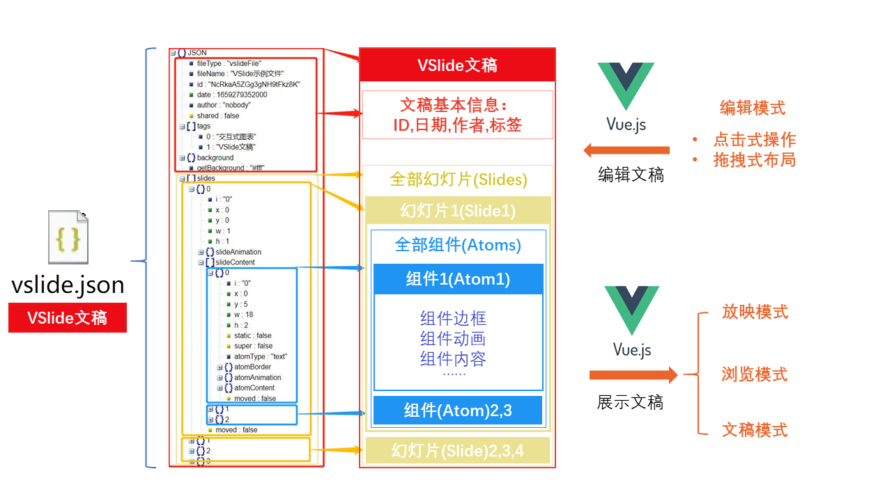

<h1 align="center">欢迎使用微思文稿 👋</h1>

信息技术飞速发展，大数据时代已然到来，数据正日益成为人类社会中重要的生产要素。数据可视化，也即以人类直观易懂的形式对数据进行呈现，是数据挖掘以及信息展示的重要环节，对于发掘数据背后的价值，有重要意义。

VSlide，一款基于网页的数据可视化工具应运而生，旨在让普通用户便捷地创作支持交互式数据可视化图表的演示文稿。

## Demo

[vslide.cn](https:/vslide.cn)

## Get Started

```sh
npm install
npm run serve
npm run build
```
## Features
## 简单易用
零代码制作交互式图表，点击式操作，推拽式布局，不需要任何基础,使用文档详细。


## 交互式图表
各类图表应有尽有，所有图表均支持交互




## 组件丰富
除交互式图表外,也支持图片,表格,文本,markdown


## 灵活布局
18 × 18网格,自由拖拽，随意布局。


## 功能强大
- 编辑模式下制作幻灯片
- 放映、浏览、文档模式下展示幻灯片，放映模式支持动画。



## 一键分享
一键复制分享链接，让更多人看到你的作品

## Structure

| **名称**        | **协议**         | **功能**            |
| --------------- | ---------------- | ------------------- |
| [Vue.js](https://vuejs.org/)          | MIT              | 数据驱动            |
| [Vuex](https://vuex.vuejs.org/)           | MIT              | Vue数据中心化管理   |
| [Echarts](https://echarts.apache.org/)         | Apache-2.0       | 交互式可视化图表    |
| [Vue-echarts](https://github.com/ecomfe/vue-echarts)     | MIT              | Vue版本的echarts    |
| [Vue-grid-layout](https://jbaysolutions.github.io/vue-grid-layout/) | MIT              | 布局与排版          |
| [Naive UI](https://www.naiveui.com/)       | MIT              | UI组件，表单组件    |
| [md-ediotr-v3](https://imzbf.github.io/)        | MIT              | Markdown编辑器          |
| [Animate.css](https://animate.style/)     |  Hippocratic License   | 动画控制            |
| [Handsontable](https://handsontable.com/)        |               | 数据输入          |
## Show your support

Give a ⭐️ if this project helped you!
