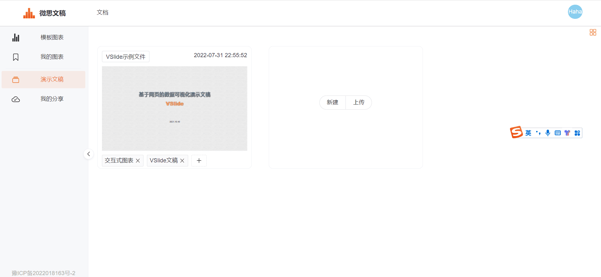
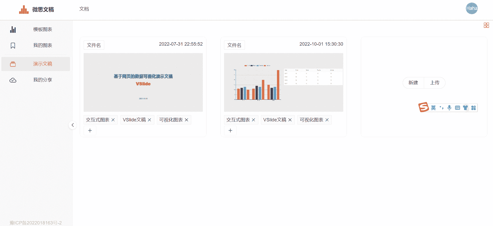
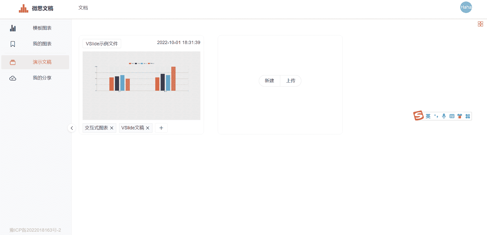
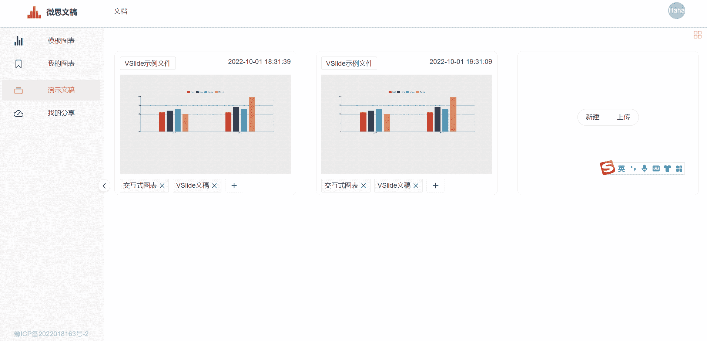
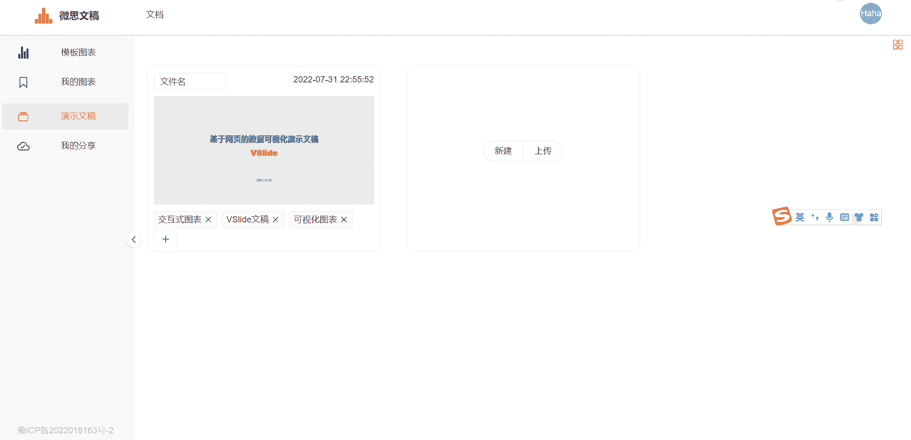
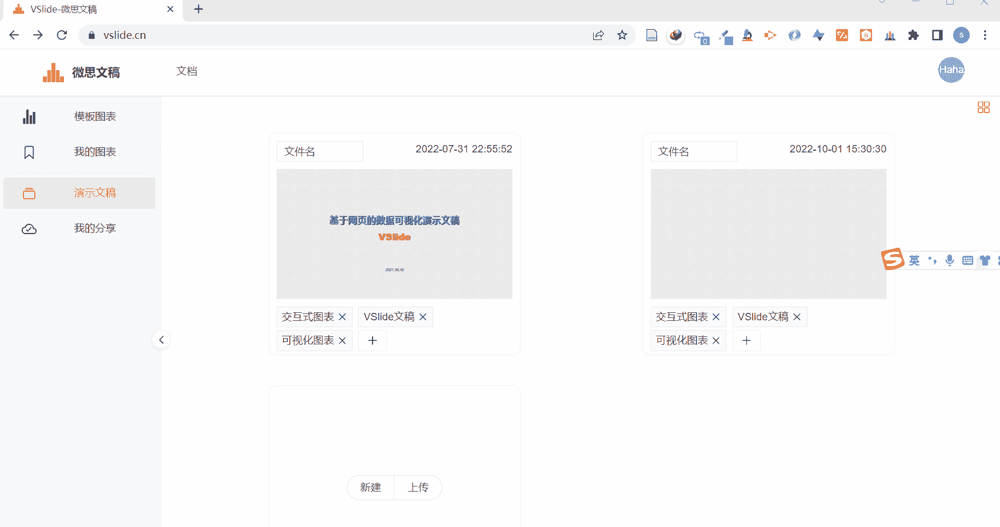

`演示文稿`界面展示保存在本地的文稿文件。有`卡片视图`和`表格视图`两种视图模式,可点击页面右上角的按钮进行切换。
:::tip 提示
`分享`操作仅可在`卡片视图`下进行。
:::

## 文稿信息

用户可以修改文稿的`文件名`和`标签`。
### 文件名
最多10个汉字。
### 标签
最多5个标签。

## 编辑
进入[编辑模式](./slide.md)。

## 放映
进入[放映模式](./show#放映模式)。

## 浏览
进入[浏览模式](./show#浏览模式)。

## 文稿
进入[文稿模式](./show#文稿模式)。

## 复制
复制文稿文件。

## 删除

删除文稿文件。

正在分享的文稿请在取消分享后删除。

::: warning 警告
删除后，文稿将从本地删除，不可找回，请谨慎操作。
:::

## 下载
将文稿文件(json格式)下载到本地，可以在需要时重新导入本地文件，也可发送给他人。

## 分享

将文稿文件上传到服务器，可以获得用于分享的网页链接，联网情况下打开链接可直接展示演示文稿(放映、浏览、文稿三种模式)，可以分享链接给他人。

正在分享的文稿列表将展示在[我的分享](./shared-slides.md)。

## 取消分享

`卡片视图`模式下，已分享的文稿右上角会出现`云端`的按钮，点击后可以选择取消分享。取消分享后，分享链接将失效。

## 更新

已经分享的文稿，如果在分享后，进行了编辑更改，则需要更新，更新分两步：先取消分享，之后再分享。