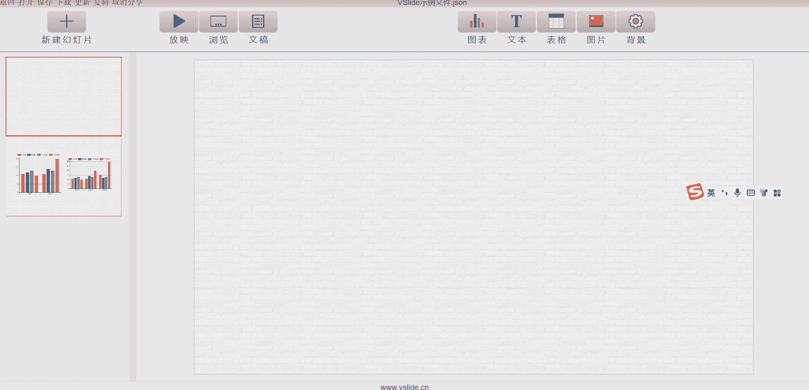
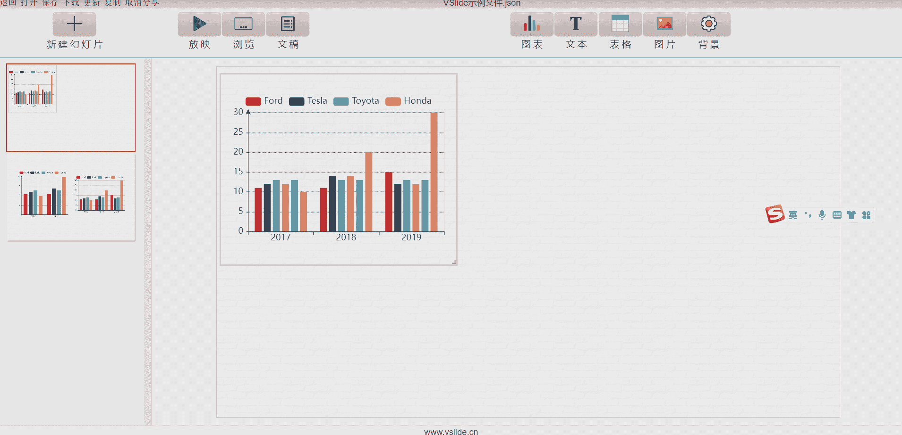
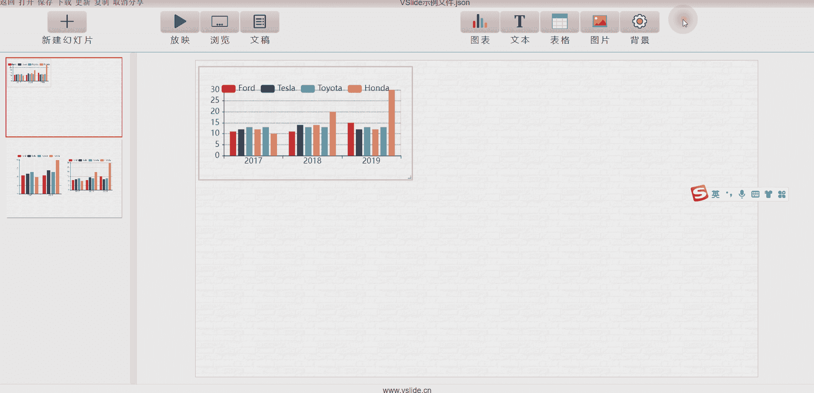
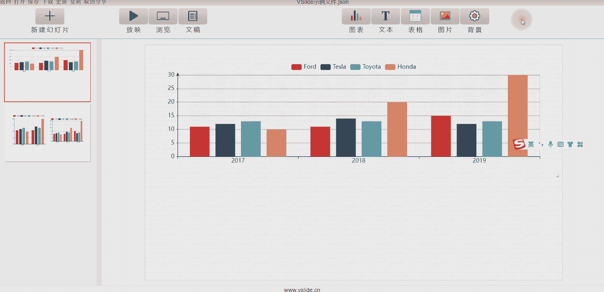
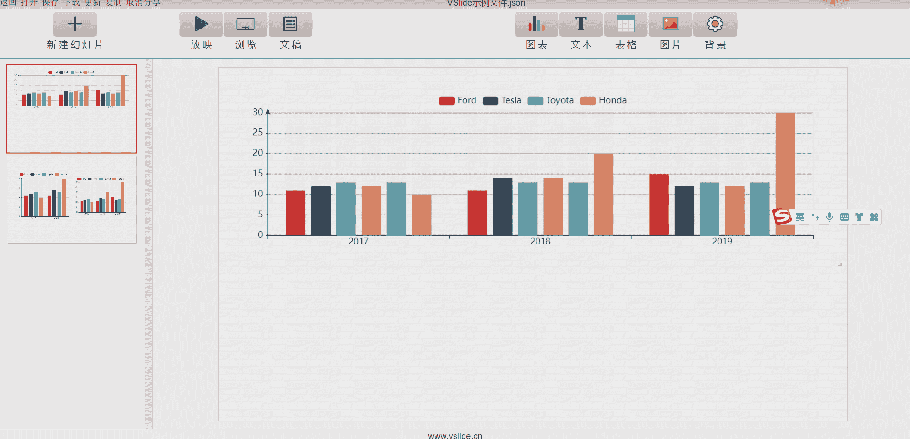
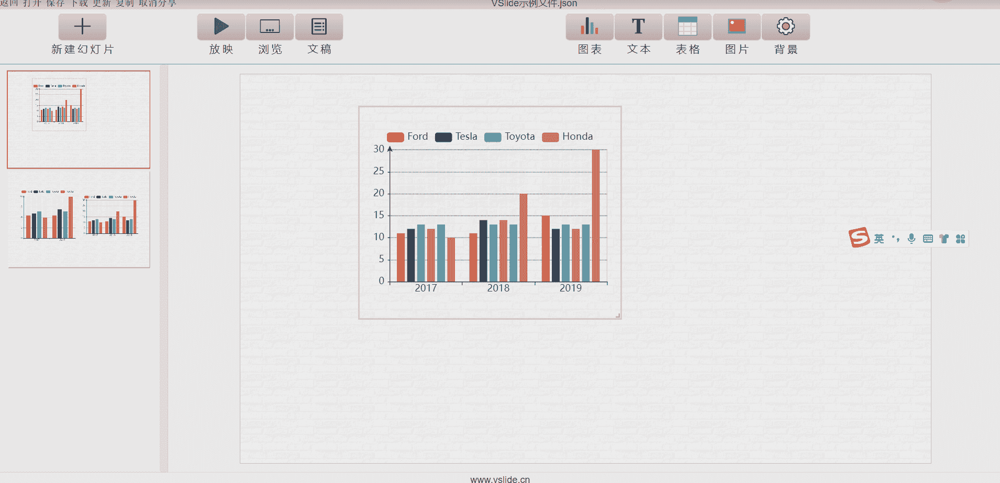
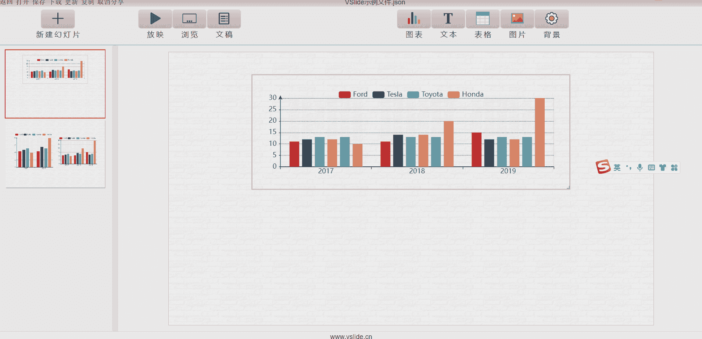
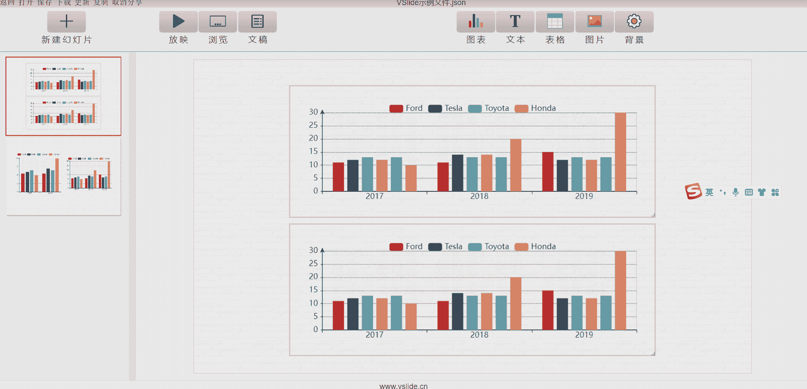

新建一张空白幻灯片后，接下来的工作就是向幻灯片(Slide)内添加组件(Atom)。

> VSlide当前支持的展示组件包括：

| [**柱状图**](../atom/bar.md) |  [**折线图**](../atom/line.md)   | [**饼图**](../atom/pie.md)  |  [**地图**](../atom/map.md)  | [**统计图表**](../atom/stats.md) |[**其他图表**](../atom/other-chart.md) |
| :----: | :----:  | :----:  | :----:  | :----:  | :----:  |
| [基础柱状图](../atom/bar.md#柱状图) | [基础折线图](../atom/line.md#折线图)  | [饼图](../atom/pie.md#饼图)  | [地图-离散](../atom/map.md#地图-离散)  | [散点图](../atom/stats.md#散点图)  |[雷达图](../atom/other-chart.md#雷达图) |
| [柱状图(缩放)](../atom/bar.md#柱状图-缩放) | [折线图(缩放)](../atom/line.md#折线图-缩放)  | [环形图](../atom/pie.md#环形图)  | [地图-连续](../atom/map.md#地图-连续)  | [气泡图](../atom/stats.md#气泡图)  |[桑基图](../atom/other-chart.md#桑基图) |
| [柱状图(时间轴)](../atom/bar.md#柱状图-时间轴) |   |   |   | [箱线图](../atom/stats.md#箱线图)  |[热力图](../atom/other-chart.md#热力图) |
|  |   |   |   | [回归](../atom/stats.md#回归)  |[词云图](../atom/other-chart.md#词云图) |
|  |   |   |   |   |[人口 金字塔图](../atom/other-chart.md#人口金字塔图) |

|[**文本**](../atom/text.md)|[**表格**](../atom/table.md)|[**图片**](../atom/image.md)|
|:----:  | :----:  | :----:  |
|[单行文本](../atom/text.md#文本)  | [表格](../atom/table.md#表格)  | [单张图片](../atom/image.md#单张图片)  |
|[Markdown文本](../atom/text.md#markdown文本)  |   | [多张图片](../atom/image.md#多张图片)  |

## 插入
点击`图表`,`文本`,`表格`,`图片`按钮即可弹出可供选择的组件元素，双击后插入到幻灯片内。

:::tip 提示
VSlide会计算当前幻灯片中较大的空白区域的一半作为新插入组件的默认位置，插入前请预留好空间。
:::

## 移动
鼠标移至组件上方，可以拖动组件，调整组件布局。

## 拖拽

点击组件右下角的拖拽按钮可改变组件大小。

## 数据
修改组件数据。

## 样式
修改组件样式。

## 边框
修改组件边框。

## 动画

出场次序为1(默认值)的组件将随幻灯片直接显示，无动画效果。如果想控制组件的出场顺序，请修改出场次序(>1)和进入动画。
:::tip 提示
受控播放和动画仅在`放映模式`下有效。
:::

## 固定
固定组件。 组件固定后，将不可移动和拖拽，取消固定后恢复。

:::tip 提示
固定/取消固定的快捷方式是**双击**组件。
:::

## 复制

复制组件至当前幻灯片。默认复制的组件会显示在被复制组件的下方，请预留好位置。

## 删除
删除组件。

## 保存

保存组件至[我的图表](./local-layout)。
