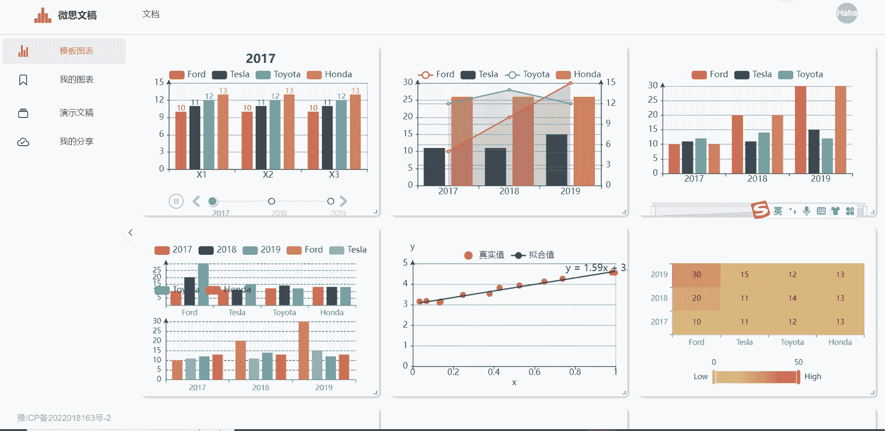
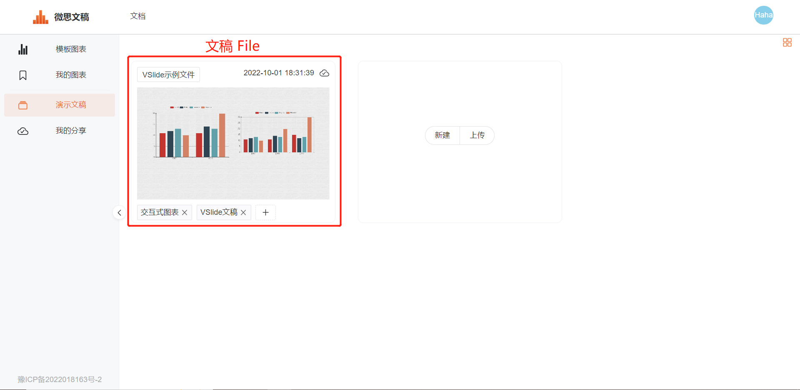
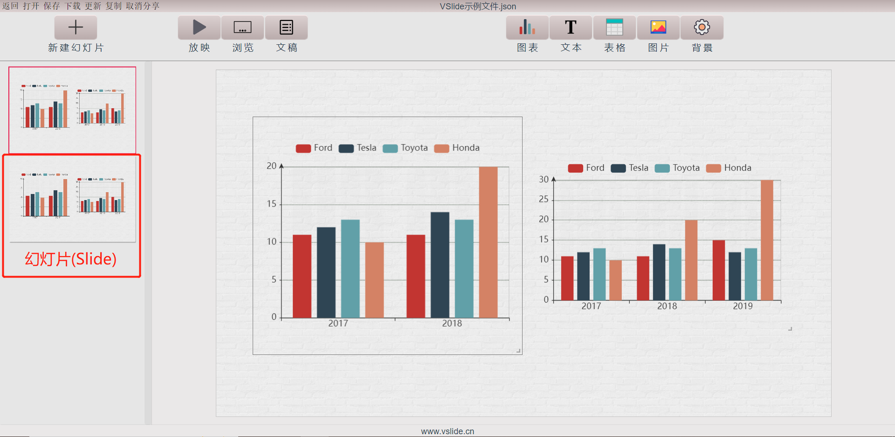
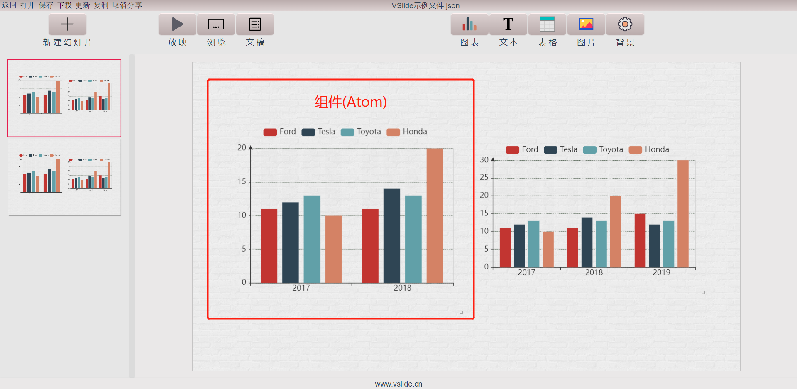

在开始阅读使用指南之前，请您先了解下VSlide里的几个概念。

::: tip 提示
VSlide的很多功能是基于**右键菜单**实现的，记得使用右键菜单。
:::

## 文稿(File)
一份VSlide文稿，就是一份用VSlide创作的文稿文件，为json格式。该文件记录了演示文稿的全部信息，包括文件名、作者、创建日期等，当然最重要的是记录了每一张幻灯片(Slide)的信息。一份文稿一般包含多张幻灯片(Slide)。

## 幻灯片(Slide)
一张幻灯片可以包含多个组件(Atom)。一个或多个组件，按照用户的`拖拽`和`缩放`有序排列，构成一张幻灯片。

## 组件(Atom)
组件是VSlide文稿中信息展示的最小单元。VSlide支持图表、文本、表格、图片四大类组件。组件的配置(如数据、样式、边框、动画等)可以修改。
