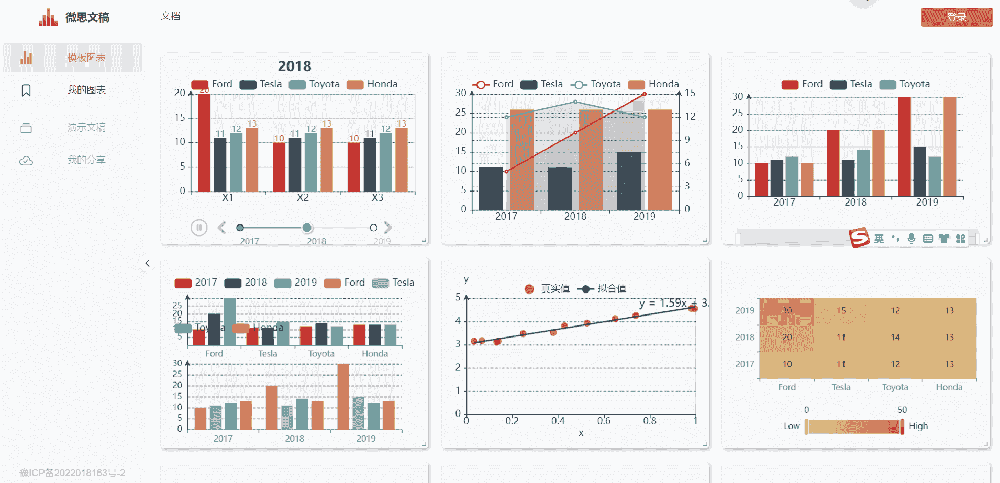
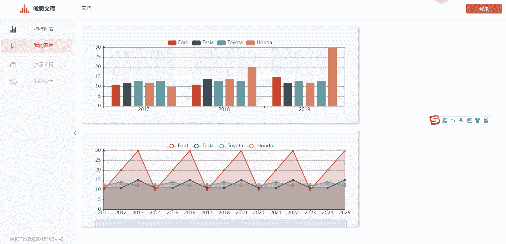
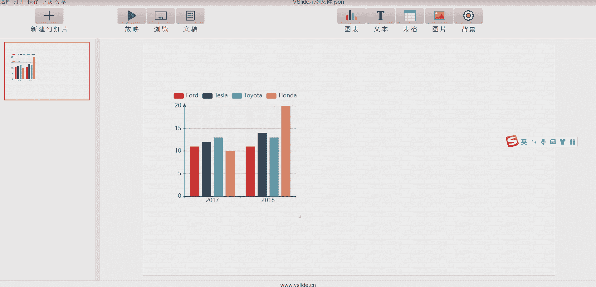

## 简单易用
零代码制作交互式图表，点击式操作，推拽式布局，不需要任何基础,使用文档详细。

## 交互式图表
各类图表应有尽有，所有图表均支持交互
| [**柱状图**](../atom/bar.md) |  [**折线图**](../atom/line.md)   | [**饼图**](../atom/pie.md)  |  [**地图**](../atom/map.md)  | [**统计图表**](../atom/stats.md) |[**其他图表**](../atom/other-chart.md) |
| :----: | :----:  | :----:  | :----:  | :----:  | :----:  |
| [基础柱状图](../atom/bar.md#柱状图) | [基础折线图](../atom/line.md#折线图)  | [饼图](../atom/pie.md#饼图)  | [地图-离散](../atom/map.md#地图-离散)  | [散点图](../atom/stats.md#散点图)  |[雷达图](../atom/other-chart.md#雷达图) |
| [柱状图(缩放)](../atom/bar.md#柱状图-缩放) | [折线图(缩放)](../atom/line.md#折线图-缩放)  | [环形图](../atom/pie.md#环形图)  | [地图-连续](../atom/map.md#地图-连续)  | [气泡图](../atom/stats.md#气泡图)  |[桑基图](../atom/other-chart.md#桑基图) |
| [柱状图(时间轴)](../atom/bar.md#柱状图-时间轴) |   |   |   | [箱线图](../atom/stats.md#箱线图)  |[热力图](../atom/other-chart.md#热力图) |
|  |   |   |   | [回归](../atom/stats.md#回归)  |[词云图](../atom/other-chart.md#词云图) |
|  |   |   |   |   |[人口 金字塔图](../atom/other-chart.md#人口金字塔图) |

## 组件丰富
除交互式图表外,也支持图片,表格,文本,markdown
|[**文本**](../atom/text.md)|[**表格**](../atom/table.md)|[**图片**](../atom/image.md)|
|:----:  | :----:  | :----:  |
|[单行文本](../atom/text.md#文本)  | [表格](../atom/table.md#表格)  | [单张图片](../atom/image.md#单张图片)  |
|[Markdown文本](../atom/text.md#markdown文本)  |   | [多张图片](../atom/image.md#多张图片)  |

## 灵活布局
18 × 18网格,自由拖拽，随意布局。

## 功能强大
- 编辑模式下制作幻灯片
- 放映、浏览、文档模式下展示幻灯片，放映模式支持动画。

## 一键分享
一键复制分享链接，让更多人看到你的作品
