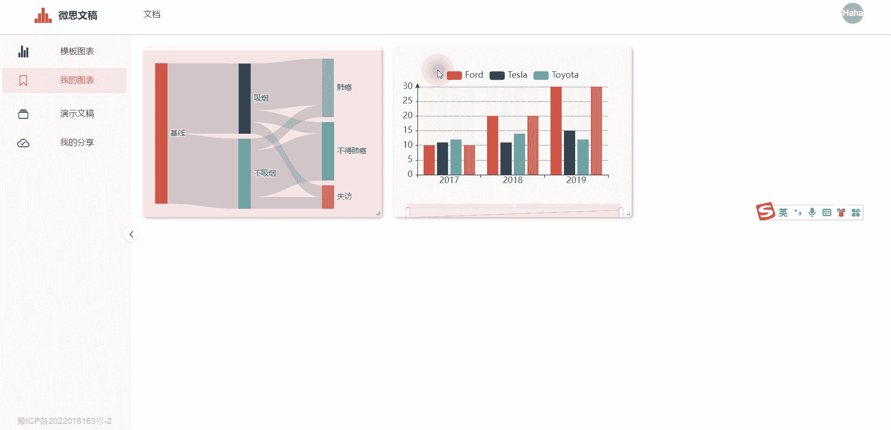

`我的图表`界面展示保存在本地的图表。

`我的图表`的来源有三种：分别为`模板图表→保存`、`我的图表→复制`以及在[编辑模式](./atom.md#保存)下`组件→保存`。三种来源的`我的图表`都将被持久化地保存在本地电脑上，并展示在`我的图表`界面里,直至用户主动删除图表。

:::tip 提示
`我的图表`会显示在`编辑模式`下`图表→我的`栏目内，方便插入到幻灯片内。
:::

右击图表可以修改图表的配置项。

## 数据
修改图表的数据。

## 样式
修改图表的样式。

## 复制
复制当前图表。

## 删除
删除当前图表。

::: warning 警示
删除后，图表将从本地删除，不可找回，请谨慎操作。
:::