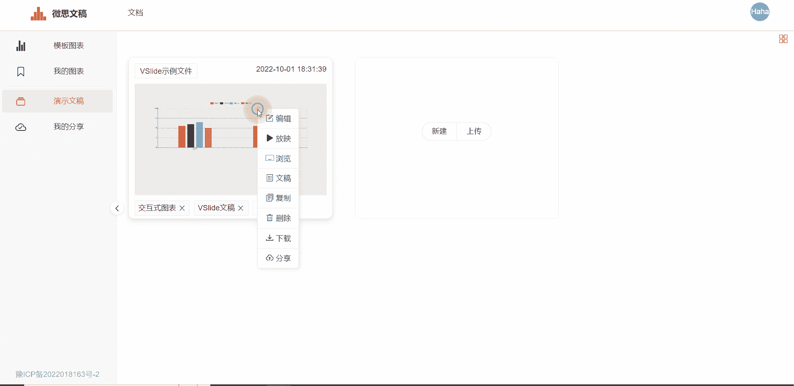
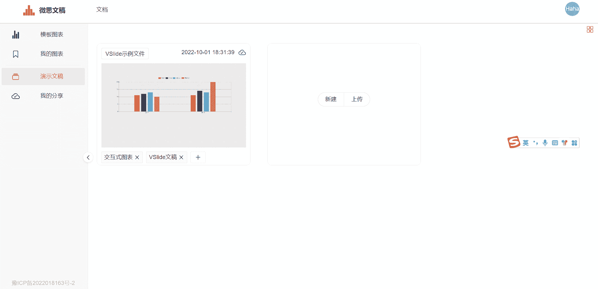

`我的分享`界面展示当前正在分享的文稿文件，所有获得链接的用户，均可访问文稿，所分享的文稿内容需遵守相关法律法规。

## 复制链接
复制文稿链接。

::: tip 提示
所有获得链接的用户，均可访问文稿，所分享的文稿内容需遵守相关法律法规。
:::
## 取消分享

取消正在分享的文稿，取消分享后，分享链接将失效。

取消分享的另一个用途是：已经分享的文稿，如果在分享后，进行了编辑更改，则需要先取消分享，再次分享。即可达到更新已分享文稿的目的。

## 会员到期

会员到期后，[用户身份](./../pricing/index.md)将自动转为`免费用户`。

`免费用户`最多可分享5个文稿。

会员到期后，将对最新分享(分享时间靠后)的5个文稿予以保留，其余的已分享文稿将自动被取消分享，**从云数据库中删除，分享链接失效。**

::: tip 提示
超出分享个数的已分享文稿被从云数据库中删除后，仍然作为`演示文稿`被保存在用户本地，用户如果主动删除文稿，则将从本地电脑彻底删除，不可找回。
:::

|     | 免费用户  |  基础会员:boom:  |
|  ---   | ---  |  ---  |
| 可分享的文稿数量 | 5个 | 50个  |
| 可分享的文稿容量 | 10M | 100M  |

[升级会员](./../pricing/pay.md)