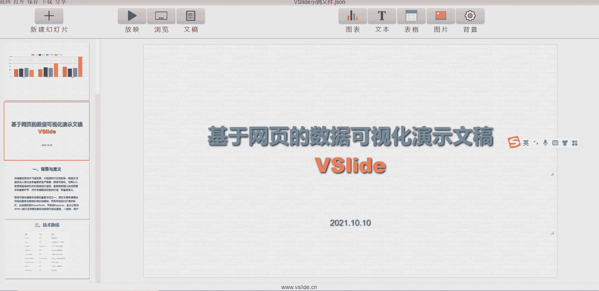

`编辑模式`也即对VSlide文稿进行编辑，是VSlide的核心功能。如前所述，一份文稿(File)一般包含多张幻灯片(Slide)。

## 新建
点击页面顶部的`新建幻灯片`按钮或者在幻灯片上右击选择`新建幻灯片`即可插入空白的幻灯片。

## 复制
复制当前幻灯片。

## 删除
删除当前幻灯片。

::: tip 提示
删除‘首张幻灯片’的正确方式是，先调换顺序后删除。
:::

## 调换顺序
拖动左侧幻灯片位置可调换幻灯片顺序。

## 修改背景

点击`背景`按钮可以修改幻灯片背景。背景支持的样式如下：

|类型|样式|类型|样式|
|---|---|---|---|
|纯色|纯色背景|纹理|纹理图片平铺作为背景|
|线性渐变|线性渐变色作背景|图片|图片被拉伸填满整个背景|
|径向渐变|镜像渐变色作背景|自定义|自定义背景的css样式|

