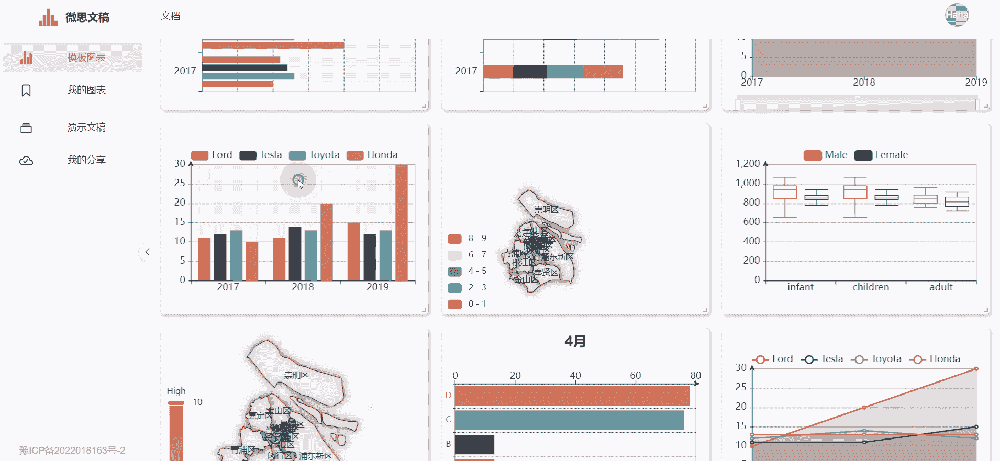
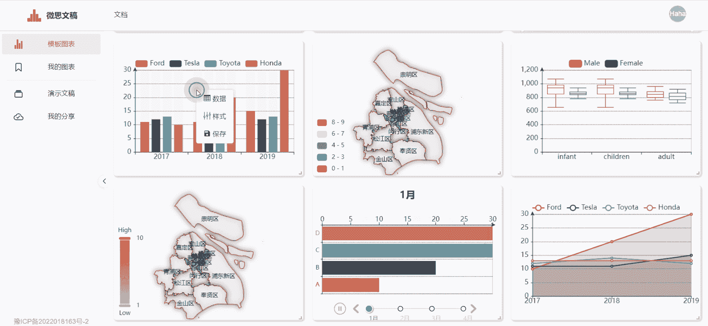
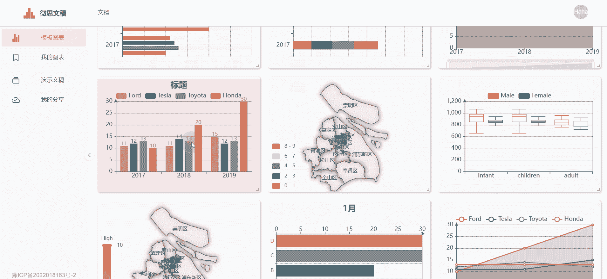

图表是VSlide中最主要的组件类型，因此下文中的 `模板图表` 和 `我的图表` 也可理解为 `模板组件` 和 `我的组件`。

`模板图表`界面展示VSlide自带的默认图表，每次打开VSlide的网站，看到的模板图表都是相同的。通过修改模板图表的数据和样式，可以得到个性化的图表(`我的图表`)，右键保存后，`我的图表`将被持久地保存到本地电脑上，可以在需要时插入到演示文稿中。

::: tip 提示
VSlide的很多功能是基于**右键菜单**实现的，记得使用右键菜单。
:::

右击图表可以修改图表的配置项。

## 数据
修改图表数据。

## 样式
修改图表样式。

## 保存
保存图表至[我的图表](./local-layout.md)。
