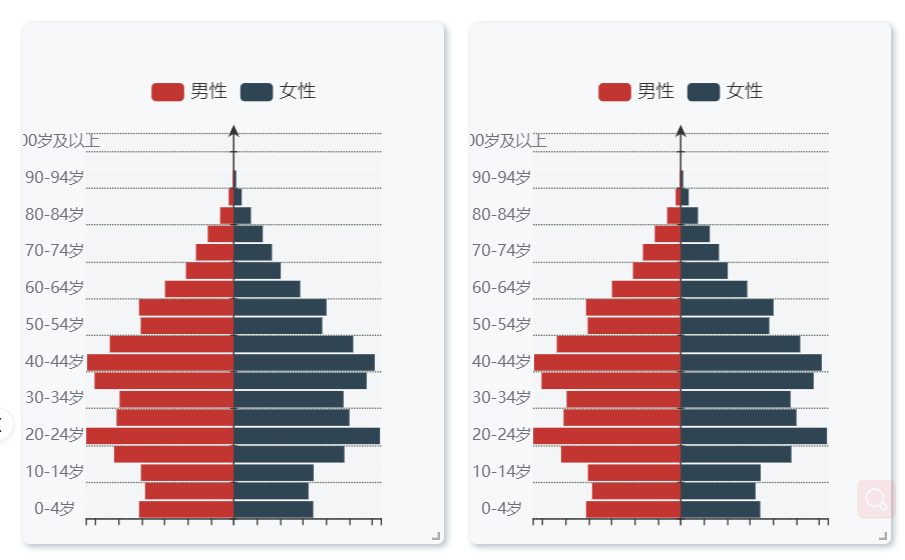
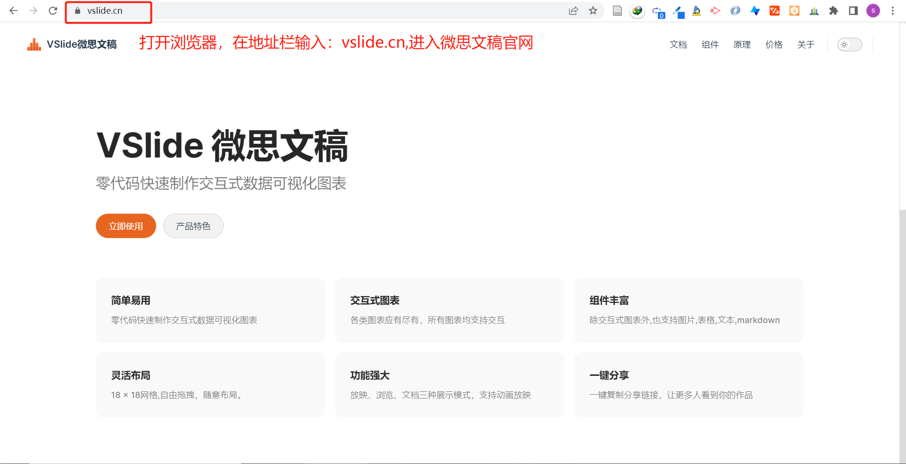
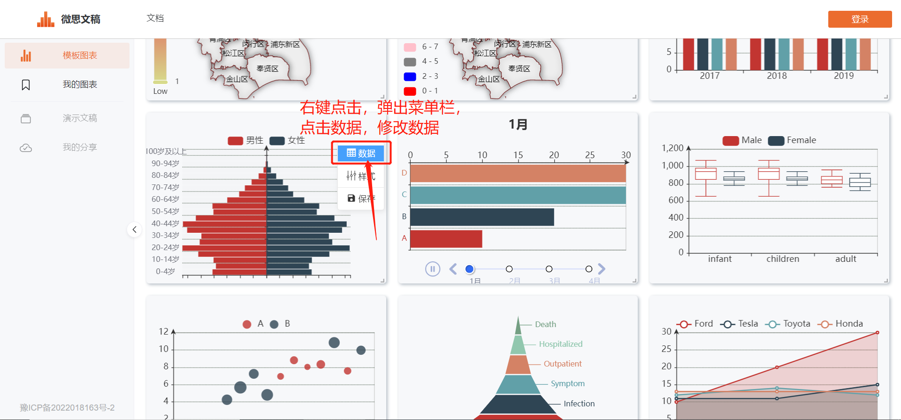
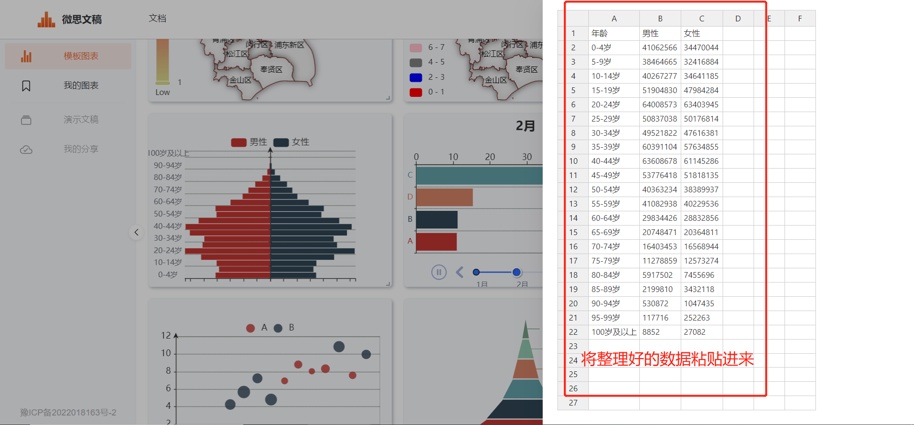
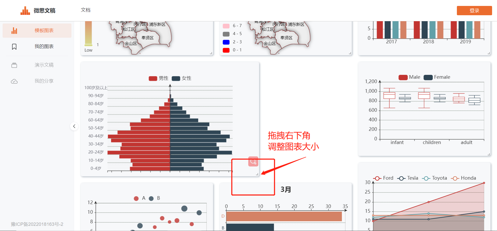
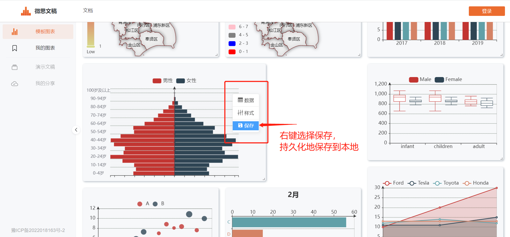
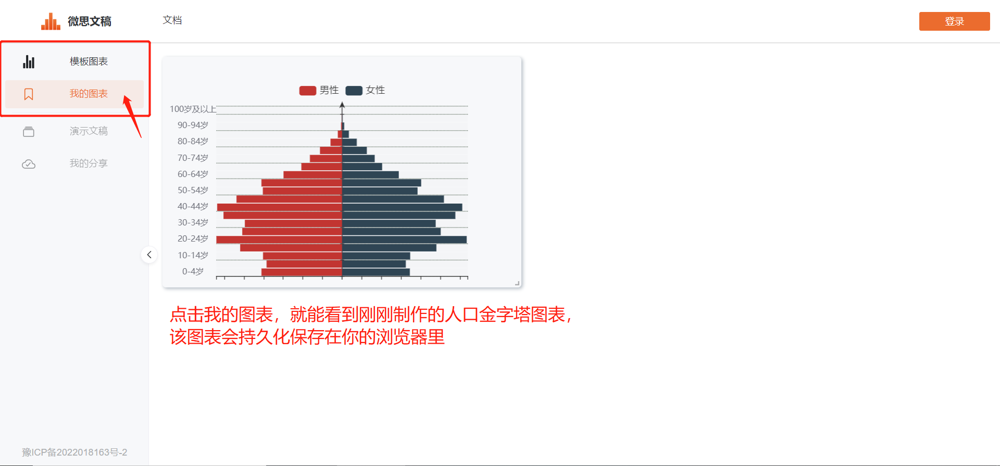

# 📈📉📊如何5秒钟制作人口金字塔图

## Step1 打开浏览器，在地址栏中输入“vslide.cn”,进入微思文稿官网

## Step2 点击“立即使用”进入在线图表制作工作台

## Step3 找到人口金字塔图，右键弹出菜单，点击修改数据

## Step4 将整理好的人口数据复制粘贴进来

## Step5 点击图表右下角的拖拽标识，修改图表大小

## Step6 右键点击“保存”，将制作好的图表保存至本地

## Step7 点击左侧“我的图表”栏目，就能看到制作好的图表啦

今天的分享到这里就结束了，你学会了吗？登录微思文稿(vslide.cn)，免费制作更多图表吧~