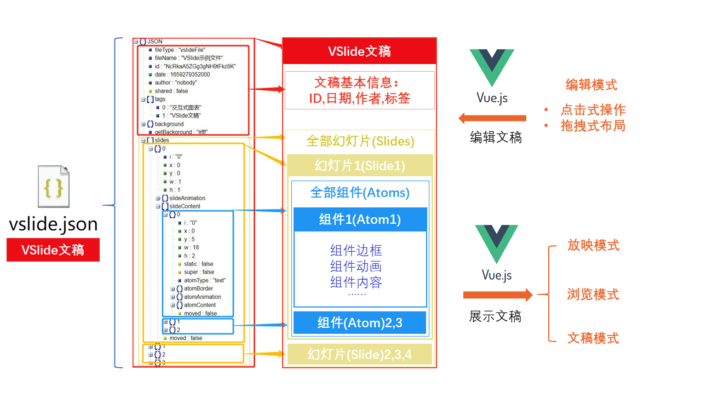

## 顶层设计

JSON格式的`VSlide文稿`存储了渲染文稿所需要的全部数据，是一切的核心。

`编辑模式`下，用户通过点击式操作修改幻灯片配置项进行文稿创作，本质是修改`VSlide文稿`。

`放映、浏览及文稿模式`下，JSON格式的`VSlide文稿`被渲染为幻灯片(网页)。

## 数据流向

`Vue`的`v-model`双向数据绑定很受欢迎，但在本项目中，双向绑定不太适用。

原因是VSlide中的组件元素(主要是Echarts图表)的配置项多而繁杂，双向数据绑定缺乏灵活性。

VSlide中数据是单向流动的，即`编辑器`修改`VSlide文稿`数据,`VSlide文稿`数据改变后，相应地展示出来的幻灯片也随之改变。
